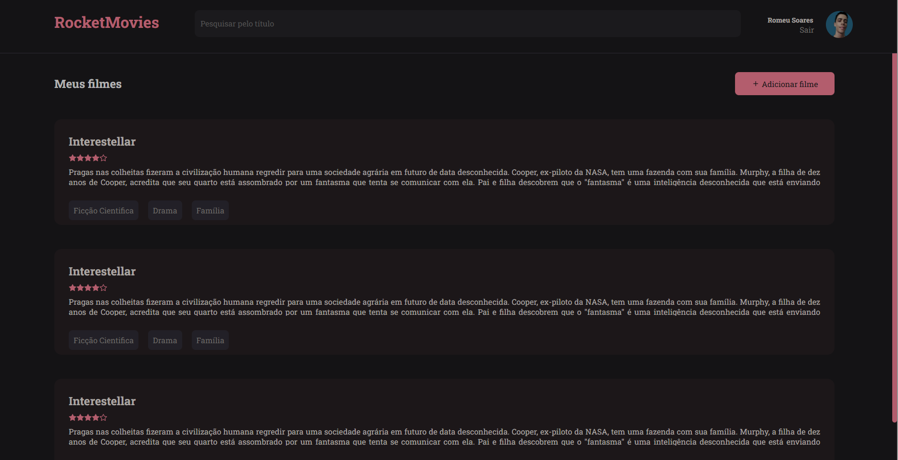
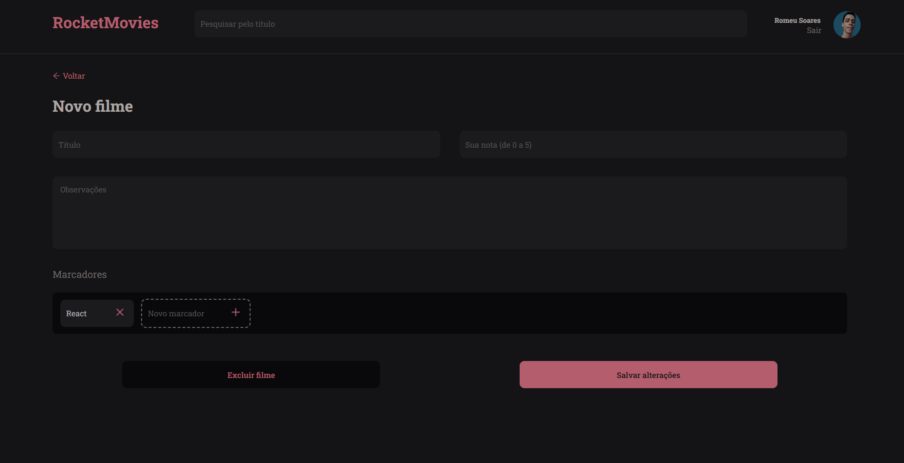

## Projeto RocketMovie

> Página front-end com aplicação <strong>react.js</strong>

> A ideia é mostrar notas de filmes que o usuário cadastre em uma lista, podendo ter:

- Título
- Nota de avaliação
- Observação 
- Tags

[😊⭐⭐Clique aqui para acessar⭐⭐😊](https://rocket-movie.vercel.app)

# Tecnologias utilizadas
- HTML
- CSS
- JAVASCRIPT
- REACT

# Vamos nos conectar!
- [linkdin⭐](https://www.linkedin.com/in/romeu-soares-87749a231/)

- [Instagram⭐](http://instagram.com/romeusoaresdesouto)